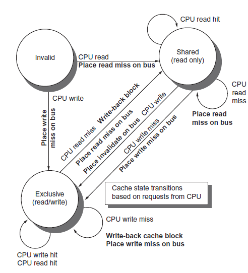
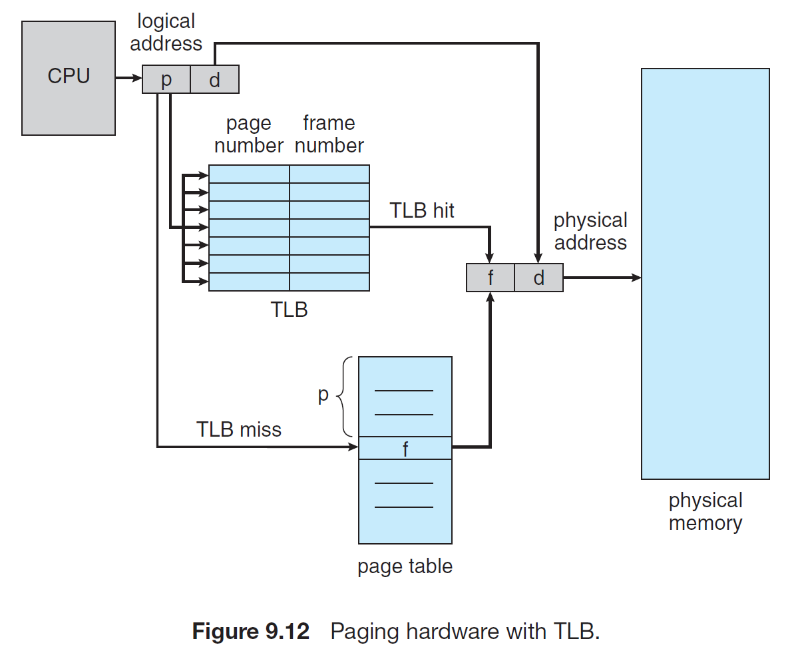

**문제를 통해 배우는 컴퓨터 구조**
<!--more-->

**Q1. In virtual memory systems, performance is degraded due to page accesses (twice, at least). How can we reduce the number of page accesses.**  

A: 2배 이상 걸리는 이유: 2번의 memory accesses(physical address를 가져오는 것과 data를 가져오는 것)  

이때 address translation에 locality가 존재하므로, address translation을 저장하는 cache인 TLB(translation look-ahead buffer)를 설계해 page table에 대한 access 수를 줄인다.

**Q2. What is cache associativity? What is the relation between associativity and cache hit rate?** 

각 메모리 주소마다 캐시에 저장되는 공간이 정해지는데(full-associativity 제외), 공간의 개수를 associativity.   
cache associativity는 tag 마다 associativity가 높을수록 hit rate는 높아지지만 hit gain이 감소한다.  


**Q3. Compared to single cycle implementation, what is the advantage of pipelining? List all the types of hazards and explain them. Additionally, write the solutions to all the types of hazards except stall.**  

single cycle implementation의 작업을 쪼개 한 stage 당 작은 단위의 작업을 처리하기 때문에 clock speed를 높이기 쉬우며, 한 cycle에 여러개의 명령어가 처리될 수 있다.  
따라서 resource utilization가 높아지며 최종적으로 throughput이 증가해 성능이 증가한다.  

**pipeline architecture에 존재하는 3가지의 hazard가 존재한다.**  

**Control hazard**: branch나 jump instruction가 decoding되거나 resolve 될 때, 이전 명령어들은 전부 flush된다.  
-> branch prediction을 통해 flush로 발생하는 penalty를 줄일 수 있다.  

**Structural hazard**: stage 당 명령어를 처리할 수 있는 resource가 한정되어 있으므로, 명령어는 다음 스테이지의 자원이 사용가능해질 때까지 stall된다.  
-> stage 당 h/w resource를 추가함으로서 해결할 수 있다.  

**Data hazard**: data에는 dependency (Read After Write, Write After Read, Write After Write)가 존재하므로, dependency가 없어질 때까지 stall 된다.  
-> WAW, WAR hazard 같은 경우에는 OoO(Out-of-Order) 프로세서에서 발생하는 data hazard로, tomasulo's algorithm을 사용해 register renaming을 통해 해결할 수 있다.  

**Q4. For I/O operations, there are two methods: polling and interrupt. Explain two methods and present pros and cons of each method.**

**Polling**: host가 status bit을 주기적으로 읽어 I/O operation을 확인한다.  
    pros: 간단하기 때문에 high throughput I/O 구성이 가능하다.   
    cons: process의 trigger가 힘들다. 따라서 Time-sensitive한 application의 경우 좋은 성능을 내기 힘들다.  

**Interrupt**: host가 I/O operation의 작업상태를 device로 부터 signal을 받아 확인하여 비동기적 동작이 가능하다.  
    pros: host는 i/o instruction을 실행하고 host작업을 계속 할 수 있다. interrupt handling을 통해 효율적인 시스템관리가 가능하다.  
    cons: 너무 많은 interrupt는 오히려 성능을 나빠지게 하는 원인이 된다. (interrupt handling의 overhead가 크기 때문)  

**Q5. Explain RAID(Redundant Array of Inexpensive Disks)**

드라이브를 병렬적으로 동작시켜서 R/W rate를 향상시키고, 여러 드라이브에 데이터를 저장함으로서, 한 드라이브가 망가지더라도 데이터의 손실로 이어지지 않게 하는 disk organization techniques을 RAIDs라 한다.   
RAIDs는 크고 비싼 디스크 대신, 작고 싼 디스크들을 이용해 구성하여 가격효율이 좋다. 요즘에는 높은 reliability와 higher data-transfer에 초점이 맞춰져 있어서 "inexpansive" 뿐만 아니라 "Independent"라는 의미를 담고 있기도 하다.  

**Q6. Explain the feature of RISC processors**

RISC(Reduced Instruction Set Computer)-based architecture는 간단한 instruction을 통해 두가지 측면에서 큰 특징을 갖는다.  
Instruction-Level-Parallelism (pipelining 부터 multiple instruction issue)을 달성하기 쉽다.  
Simple operation set으로 인해 실수가 적다.  

**Q7. Explain superscalar structure and superpipeline structure.**  

Superscalar: fetch multiple instructions  
Superpipeline: pipeline stage를 더 작은 단위의 stage로 쪼갠다. 따라서 각 stage마다 매 사이클마다 여러 명령어가 처리될 수 있도록한다.  
두 아키텍처 모두 ILP를 증가시켜 성능을 향상 시키기위한 구조이다.  

**Q8. Explain cache coherence protocol in multiprocessor systems**
with an example.(pg. 385)  

multiprocessor system에서는 각 프로세서가 각자 캐시를 갖고 있으므로 같은 메모리주소에 서로 다른 값을 갖고있을 수 있는 문제가 발생했다. 이 문제를 두고 cache coherence problem이라고 한다.  

하나의 대원칙: 값을 읽을 때, 가장 최근에 쓰여진 값을 반환해야 한다.

- Coherence: 읽기를 통해 어떤 값이 반환이 되어야 하는가 (e.g. write serialization)  
- Consistency: 쓰여진 값이 언제 반환될 건지 결정  
Snooping Protocol (a single private cache block using write invalidation protocol and a write-back cache)
{: width="50%" height="50%"0}{: .center}

finite-state diagram으로 봤을 때, 3가지 state가 존재한다.  
invalidate: 해당 block 사용불가  
shared: 해당 block은 잠재적으로 공유된다는 것을 가리킨다.    
modified: private cache에서 update 된 block을 가리킨다.(다른 private cache의 block과 배타적임)  


**Q9. Explain DMA(Direct Memory Access).**  

CPU(host) 개입없이 device controller가 data block을 MM으로 직접 전송할 수 있다. 

**Q10. Why do we need TLB (Translation Lookahead Buffer). In case of page fault, explain the operation of the TLB?**  

{: width="50%" height="50%"0}{: .center}

빠른 Context-Switching을 위해 page table을 사용하며, page table은 매우크기 때문에 main memory에 저장한다.  
하지만 main memory에 저장되어 있기 때문에 여전히 매우 느린 memory access time을 갖고 있다(page table entry access -> access actual data).  
따라서 이 문제를 해결하기 위해 fast-lookup hardware cache를 이용해 빠르게 page number를 찾게 되면 frame number를 memory access에 바로 사용할 수 있다.  

page fault handling에서 missing page를 file system에서 가져와 physical memory에 저장하고, page table과 TLB에 반영을 한다. 
그러고 나서 다시 명령을 수행한다. 이때 TLB에는 missing page가 들어있으므로, TLB에서는 page hit이 된다.   

**Q11. What is CPI? In case CPI is low, performance may be higher. But this is not always true; explain this case.** 

clock per instruction; 프로그램 A를 machine X 와 Y에서 동작할 때, X는 3GHz로 동작하며 CPI가 1.5, Y는 1GHz로 동작하며 CPI가 1이다. Instruction Count가 같을 때, 초당 X는 $2*10^9$개의 명령어를 처리하는 반면, Y는 $10^9$개의 명령어만을 처리한다. 즉, X는 CPI가 높지만 Y보다 성능이 좋다. 


**Q12. Explain Amdahl’s law. Why is the law related to “make common cases faster”?**

프로그램에서 가속하고자 하는 부분을 F라고 했을 때, F를 S만큼 가속할 수 있을 때, 개선되는 성능은 다음의 Amdahl's law로 설명할 수 있다. 
$Speed Up = 1-F + \frac{F}{S}$
따라서 가속을 하여 어플리케이션의 성능을 높이려면 가속할 수 있는 부분 F가 커야한다. 따라서 "make common case faster"가 Amdahl's law와 관련이 깊다. 

**Q13. Explain the relation between processor frequency and clock cycle time. Additionally, in case of 2GHz CPU, what is the clock cycle time in terms of ps(pico second)?**

$ps = 10^{-12} second$, 2GHz -> $2*10^9$ cycles per a second, which is sames as 1 cycles per $\frac{1}{2*10^9}$
$clock cycle time = 0.5*10^{-9} second = 0.5 * 10^{-9} * 10^{12} pico second = 500 pico second$

**Q14. Explain spatial locality AND temporal locality. How do they different? Explain with examples.**

spatial locality: 접근한 데이터 인근의 데이터에 접근할 확률이 높다. 
temporal locality: 접근한 데이터에 다시 접근할 확률이 높다. 

```cpp
int array[100];
for (int i = 0; i < 100; i++){
    array[i] += 1;
}
'''

위의 코드가 있을 때, i변수에 대해 temporal locality가 존재하며, 배열 array의 데이터에 대해 spatial locality가 존재한다. 